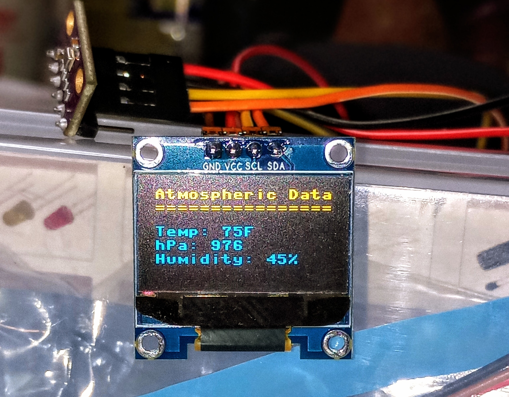
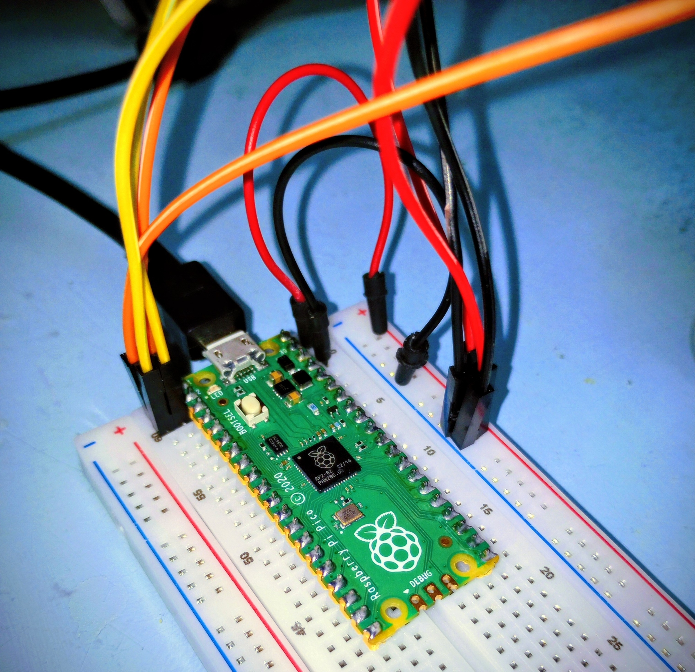

# MicroWeather Display

A MicroPython project that reads temperature, pressure, and humidity from a BME280 sensor and displays it on an SSD1306 OLED screen in real-time.




---

## Features

- Displays temperature in Fahrenheit
- Displays pressure in hPa
- Displays relative humidity in %
- Real-time updates every 3 seconds
- Simple OLED loading animation at startup

---

## Hardware Requirements

- MicroPython-compatible board (e.g., Raspberry Pi Pico)
- BME280 sensor (I2C)
- SSD1306 OLED display (128x64, I2C)

---

## Installation

1. Copy the following to your MicroPython board.

   - `main.py`
   - `bme280_float.py` — included in this repository (MIT License)  
   - `ssd1306.py` — **not included**, download from [cwyark's Gist](https://gist.github.com/cwyark)

2. Run the `main.py` script.

---

## Usage

- The display updates every 3 seconds.
- Press **Ctrl+C** to stop the program and turn off the OLED display.

---

## License

- `bme280_float.py`: MIT License (included in this repository)  
- `ssd1306.py`: Not included; please see [cwyark's Gist](https://gist.github.com/cwyark) for license and usage.
- `main.py` and README: MIT License

```
🔗 Connect with me https://www.linkedin.com/in/chris-gundes
